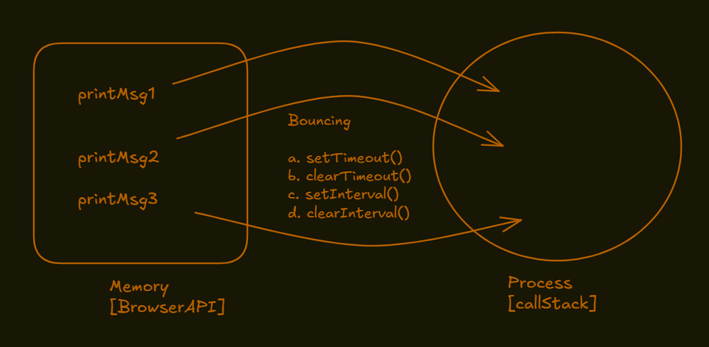

# setTimeout

a. Function inside the setTimeout forms a closure with the variables in the scope where it was defined.
b. Wherever the function goes it take the reference to the variables in the scope where it was defined.
c. `console.log("***************")` is executed first. It will not wait for setTimeout to finish.

```javascript
function x(){
    let a = 10;
    console.log("***************");
    setTimeout(function() {
        console.log(a);
    }, 3000);
    console.log("***************");
}
x();
```

```javascript
function x(){
            for(let i = 1; i <= 5; i++){
                setTimeout(function(){
                    console.log(i);
                }, i * 10000) 
            }
        }
        x();

```



**a. What is Bouncing?**
Bouncing is a technique in electronic device where function is released immediately into memory without locking.
**b. What is DeBouncing?**
DeBouncing is a technique where function is released into memory after a certain time period.
We can control the time period after which the function is released into memory.

## setInterval()

syntax => setInterval(function, timeInMilliseconds)

```javascript
function x(){
    let a = 10;
    console.log("***************");
    setInterval(function() {
        console.log(a);
    }, 3000);
    console.log("***************");
}
x();
```
