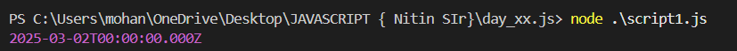
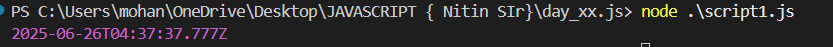

# RANGE ERROR

A RangeError is a type of error in JavaScript that occurs when a value is not within the expected range or set of values. It is commonly thrown when an operation or function receives an argument that is outside the acceptable range.

``` javascript
let arr = new Array(-3);
console.log(arr[-1]);
```

**OUTPUT**


```javascript
let now = new Date("2025-02-30");
console.log(now);
```



```javascript
let now = new Date("2025-06-31");

now.setDate(26);
now.setMonth(5);
now.setFullYear(2025);
console.log(now);
```



## IIFE {Immediately Invoked Function Expression}

```javascript
(function() {
    console.log("This is an IIFE");
})();
```

An IIFE is a function that runs as soon as it is defined. It is often used to create a private scope, avoiding polluting the global namespace.

```javascript
// Named function expression
let myFunction = function myFunc() {
    console.log("This is a named function expression");
};
myFunction(); // This will work
myFunc(); // This will throw an error because myFunc is not defined in the global scope
```
