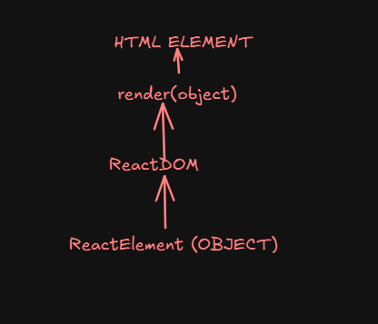

# USAGE of {} in React.CreateElement

In React, the `React.createElement` function is used to create elements. The second argument is an object containing the properties (props) you want to set on the element. If you want to include JavaScript expressions within the props, you can use curly braces `{}`.

## Example

```javascript
const element = React.createElement(
    'h1',
    { style: { color: 'blue' } },
    "Hello React"
);
```

In this example, the `style` prop is set using an object with a JavaScript expression. The text "Hello React" is passed as the children of the `h1` element.


